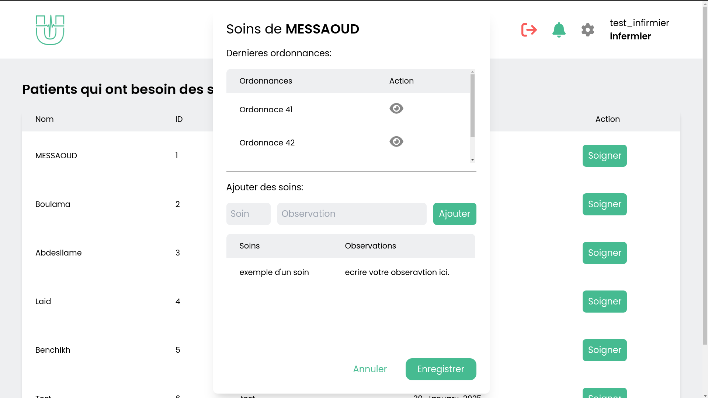

# UntilUHeal- A digital Patient Record (DPI) Management System

## Overview
The Digital Patient Record (DPI) system is an electronic medical record solution designed to centralize and manage patient information efficiently. It enhances communication among healthcare professionals and ensures better continuity of care by integrating patient data and streamlining workflows.

## Key Features
- **Patient Registration:** Digital record creation with essential identification and administrative details.
- **Medical Consultation:** Doctors can access patient records via SSN or QR code, record diagnoses, and prescribe treatments.
- **Multi-disciplinary Updates:** Nurses document treatments, pharmacists validate prescriptions, and lab technicians upload test results.
- **Interoperability:** Integration with the hospital pharmacy system via a REST API for seamless data exchange.
- **Patient Access:** Patients can view records, request medical certificates, and obtain hospitalization expense summaries.

## Technologies used:
Angular, Django, Tailwind and MySQL.

## Nota Bene:
This solution is intended for French-speaking users. Translation are not available for this moment.